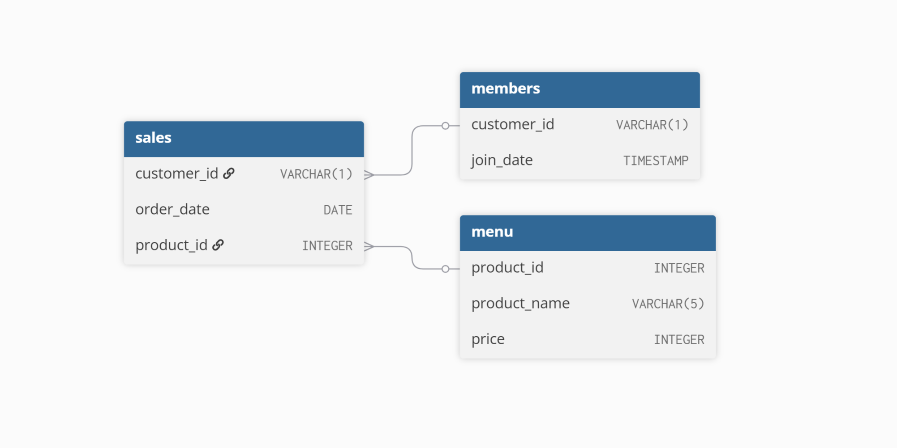

# Week 1 – Danny’s Diner

### Introduction

Danny seriously loves Japanese food, so at the beginning of 2021 he decided to embark on a risky venture and opened a small restaurant selling his three favourite dishes:

- Sushi

- Curry

- Ramen

Danny’s Diner has collected a small amount of transactional data but doesn’t yet know how to use it to better understand customer behaviour, spending patterns, and loyalty engagement.

This case study uses SQL to explore that data and provide insights to support business decisions, particularly around the restaurant’s loyalty program.

### Problem Statement

Danny wants to use his data to answer questions such as:

- How often do customers visit?

- How much do they spend?

- What are their favourite menu items?

- How effective is the loyalty program?

He also needs simple analytical datasets that his team can use to inspect customer behaviour without having to write SQL themselves.

### Available Data

Danny has provided three core tables:

#### sales

Tracks all customer purchases

<table>
<thead>
<th>Column</th><th>Description</th>
</thead>
<tbody>
<tr>
<td>customer_id</td>
<td>Unique customer identifier</td>
</tr>
<tr>
<td>order_date</td>
<td>Date of purchase</td>
</tr>
<tr>
<td>product_id</td>
<td>Item purchased</td>
</tr>
</tbody>
</table>

#### menu

Tracks all customer purchases

<table>
<thead>
<th>Column</th><th>Description</th>
</thead>
<tbody>
<tr>
<td>product_id</td>
<td>Unique product identifier</td>
</tr>
<tr>
<td>product_name</td>
<td>Name of the dish</td>
</tr>
<tr>
<td>price</td>
<td>Price in dollars</td>
</tr>
</tbody>
</table>

#### members

Tracks when customers joined the loyalty program

<table>
<thead>
<th>Column</th><th>Description</th>
</thead>
<tbody>
<tr>
<td>customer_id</td>
<td>customer identifier</td>
</tr>
<tr>
<td>join_date</td>
<td>Date they joined the program</td>
</tr>
</tbody>
</table>

### Entity Relationship Diagram



### Analysis Approach

The analysis is built using:

- JOINs to combine sales, menu, and membership data

- Window functions (ROW_NUMBER, RANK) to identify first, last, and ranked purchases

- Conditional aggregation for loyalty point calculations

- Date arithmetic for membership and bonus windows

This allows the creation of both:

- Customer-level insights

- Analytical fact tables for reporting

### Problems

##### 1. What is the total amount each customer spent at the restaurant?

```
SELECT s.customer_id, SUM(m.price) as total_amount
FROM dannys_diner.sales s
LEFT JOIN dannys_diner.menu m on s.product_id = m.product_id
GROUP BY customer_id
ORDER BY customer_id ASC
```

##### 2. How many days has each customer visited the restaurant?

```
SELECT customer_id, COUNT(DISTINCT order_date) as unique_dates
FROM dannys_diner.sales
GROUP BY customer_id
ORDER BY unique_dates ASC
```

##### 3. What was the first item from the menu purchased by each customer?

```
SELECT DISTINCT ON (s.customer_id)
  s.customer_id,
  s.order_date,
  m.product_name
FROM dannys_diner.sales s
JOIN dannys_diner.menu m
  ON s.product_id = m.product_id
ORDER BY
  s.customer_id,
  s.order_date;
```

##### 4. What is the most purchased item on the menu and how many times was it purchased by all customers?

```
SELECT m.product_name, COUNT(s.product_id) as purchase_count
FROM dannys_diner.sales s
JOIN dannys_diner.menu m ON s.product_id = m.product_id
GROUP BY m.product_name
ORDER BY purchase_count DESC
LIMIT 1
```

##### 5. Which item was the most popular for each customer?

```
SELECT
  customer_id,
  product_name,
  purchase_count
FROM (
  SELECT
    s.customer_id,
    m.product_name,
    COUNT(*) AS purchase_count,
    ROW_NUMBER() OVER (
      PARTITION BY s.customer_id
      ORDER BY COUNT(*) DESC
    ) AS rn
  FROM dannys_diner.sales s
  JOIN dannys_diner.menu m
    ON s.product_id = m.product_id
  GROUP BY s.customer_id, m.product_name
) ranked
WHERE rn = 1
ORDER BY customer_id;
```

##### 6. Which item was purchased first by the customer after they became a member?

```
SELECT r.customer_id, m.product_name as first_purchased_product
FROM (
SELECT s.customer_id, s.product_id, s.order_date, mem.join_date, ROW_NUMBER() OVER (
    PARTITION BY s.customer_id
    ORDER BY s.order_date ASC
) AS rn
FROM dannys_diner.sales s
JOIN dannys_diner.members mem ON s.customer_id = mem.customer_id
WHERE s.order_date >= mem.join_date
) as r
JOIN dannys_diner.menu m ON r.product_id = m.product_id
WHERE r.rn = 1
```

##### 7. Which item was purchased just before the customer became a member?

```
SELECT r.customer_id, m.product_name as closest_purchase_before_joining,  r.order_date,
  r.join_date
FROM (
SELECT s.customer_id, s.product_id, s.order_date, mem.join_date, ROW_NUMBER() OVER (
    PARTITION BY s.customer_id
    ORDER BY s.order_date DESC
) AS rn
FROM dannys_diner.sales s
JOIN dannys_diner.members mem ON s.customer_id = mem.customer_id
WHERE s.order_date <= mem.join_date
) AS r
JOIN dannys_diner.menu m ON r.product_id = m.product_id
WHERE r.rn = 1
ORDER BY r.customer_id
```

##### 8. What is the total items and amount spent for each member before they became a member?

```
SELECT s.customer_id, COUNT(s.product_id) as total_purchases, SUM(m.price) as total_spent
FROM dannys_diner.sales s
JOIN dannys_diner.members mem
ON s.customer_id = mem.customer_id
JOIN dannys_diner.menu m
ON s.product_id = m.product_id
WHERE s.order_date <= mem.join_date
GROUP BY s.customer_id
ORDER BY s.customer_id
```

##### 9. If each $1 spent equates to 10 points and sushi has a 2x points multiplier; how many points would each customer have?

```
SELECT s.customer_id, SUM(CASE WHEN m.product_name = 'sushi' THEN (m.price * 20) ELSE (m.price * 10) END) as total_points
FROM dannys_diner.sales AS s
JOIN dannys_diner.menu AS m
ON s.product_id = m.product_id
GROUP BY s.customer_id
ORDER BY s.customer_id
```

##### 10. In the first week after a customer joins the program (including their join date) they earn 2x points on all items, not just sushi; how many points do customer A and B have at the end of January?

```
SELECT
  s.customer_id,
  SUM(
    CASE
      WHEN s.order_date BETWEEN mem.join_date
                           AND mem.join_date + INTERVAL '6 days'
        THEN m.price * 20
      WHEN m.product_name = 'sushi'
        THEN m.price * 20
      ELSE m.price * 10
    END
  ) AS total_points
FROM dannys_diner.sales s
JOIN dannys_diner.menu m
  ON s.product_id = m.product_id
JOIN dannys_diner.members mem
  ON s.customer_id = mem.customer_id
WHERE s.order_date <= '2021-01-31'
GROUP BY s.customer_id
ORDER BY s.customer_id;

```

##### Bonus 1. recreate a table that has customer_id order_date product_name price member (Y/N)

```
SELECT
  s.customer_id,
  s.order_date,
  m.product_name,
  m.price,
  CASE
    WHEN mem.join_date IS NOT NULL
     AND s.order_date >= mem.join_date THEN 'Y'
    ELSE 'N'
  END AS member_status
FROM dannys_diner.sales s
JOIN dannys_diner.menu m
  ON s.product_id = m.product_id
LEFT JOIN dannys_diner.members mem
  ON s.customer_id = mem.customer_id
ORDER BY s.customer_id, s.order_date;

```

##### Bonus 2. query the previous table but include ranking of customers products, nullify if order happened before they were a member

```
WITH base AS (
  SELECT
    s.customer_id,
    s.order_date,
    m.product_name,
    m.price,
    CASE
      WHEN mem.join_date <= s.order_date THEN 'Y'
      ELSE 'N'
    END AS member_status
  FROM dannys_diner.sales s
  JOIN dannys_diner.menu m
    ON s.product_id = m.product_id
  LEFT JOIN dannys_diner.members mem
    ON s.customer_id = mem.customer_id
)
SELECT
  *,
  CASE
    WHEN member_status = 'Y'
      THEN RANK() OVER (
        PARTITION BY customer_id
        ORDER BY order_date
      )
    ELSE NULL
  END AS ranking
FROM base
ORDER BY customer_id, order_date;
```
